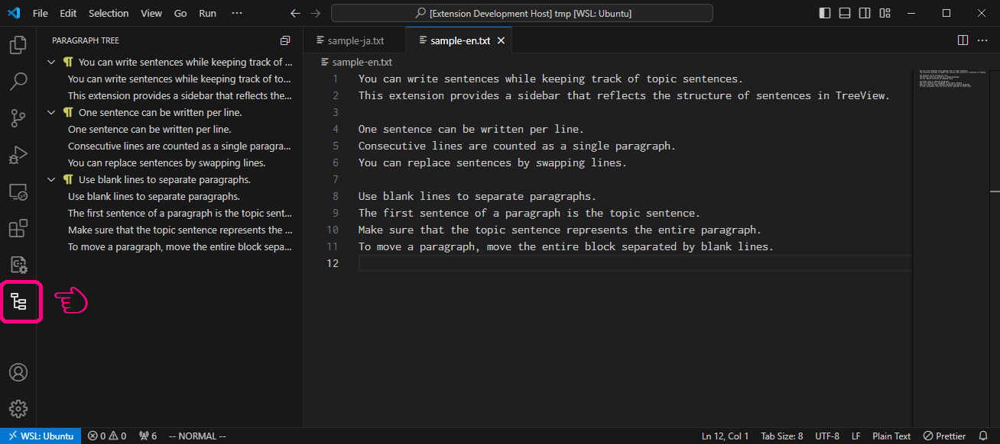

# Visual Paragraph Writing

Paragraph wriging support for VS Code.

## Features

You can write sentences while keeping track of topic sentences.
This extension provides a sidebar that reflects the structure of sentences in TreeView.

One sentence can be written per line.
Consecutive lines are counted as a single paragraph.
You can replace sentences by swapping lines.

Use blank lines to separate paragraphs. 
The first sentence of a paragraph is the topic sentence.
Make sure that the topic sentence represents the entire paragraph.
To move a paragraph, move the entire block separated by blank lines.

<!--
## Requirements

If you have any requirements or dependencies, add a section describing those and how to install and configure them.
-->

<!--
## Extension Settings

Include if your extension adds any VS Code settings through the `contributes.configuration` extension point.

For example:

This extension contributes the following settings:

* `myExtension.enable`: Enable/disable this extension.
* `myExtension.thing`: Set to `blah` to do something.
-->

<!--
## Known Issues

Calling out known issues can help limit users opening duplicate issues against your extension.
-->
