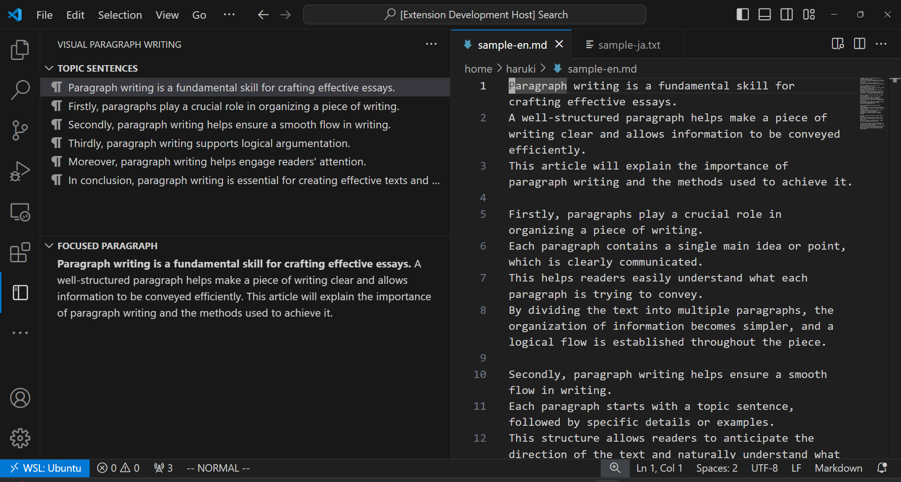

# Visual Paragraph Writing
This extension is designed to enhance your writing efficiency in Visual Studio Code.
It provides two main features to help you focus on the overall flow of your document and the content of each paragraph.

このプラグインは、文章作成時の効率を向上させるために設計されたVisual Studio Codeの拡張機能です。文章全体の流れと各段落の内容に集中できるように、以下の2つの主要機能を提供します。

## Features

### 1. Topic Sentence List
Displays a list of topic sentences in the sidebar, allowing you to easily review the structure of your document and adjust the flow as needed.

サイドバーに文章内のトピックセンテンスの一覧を表示します。これにより、文章全体の構造を一目で確認でき、必要に応じて流れを修正することができます。

### 2. Editing Paragraph Display
Shows the paragraph currently being edited in the sidebar, helping you ensure that each paragraph remains focused on a single topic.

サイドバーに編集中の段落を表示します。これにより、現在の段落が一つのトピックに集中しているかどうかを確認しながら執筆することができます。

## Usage
To maintain consistency and structure in your document, this extension follows a specific set of rules:

文章の一貫性と構造を保つために、このプラグインは特定のルールに従っています：

<dl>
<dt>
One Sentence per Line
</dt>
<dd>
Each line should contain a single sentence. This helps in easily identifying and managing individual thoughts.
</dd>
<dt>
Paragraphs as Consecutive Lines
</dt>
<dd>
Consecutive lines are treated as a single paragraph. This ensures that related sentences are grouped together.
</dd>
<dt>
Separate Paragraphs with a Blank Line
</dt>
<dd>
To divide paragraphs, insert a blank line between them. This clearly delineates where one paragraph ends and another begins.
</dd>
</dl>

<dl>
<dt>
一行に一文
</dt>
<dd>
各行には一つの文のみを記述します。これにより、個々の思考を簡単に識別および管理できます。
</dd>
<dt>
連続する行は段落として扱う
</dt>
<dd>
連続する行は一つの段落として扱われます。これにより、関連する文が一緒にグループ化されます。
</dd>
<dt>
段落を分けるには空行を挿入
</dt>
<dd>
段落を分けるためには、空行を挿入します。これにより、段落の区切りが明確になります。
</dd>
</dl>

By adhering to these rules, you can maintain a clear and organized structure in your writing, making it easier to edit and refine your document.

これらのルールに従うことで、文書の構造を明確かつ整理された状態に保ち、編集や修正が容易になります。

<!--
## Requirements

If you have any requirements or dependencies, add a section describing those and how to install and configure them.
-->

<!--
## Extension Settings

Include if your extension adds any VS Code settings through the `contributes.configuration` extension point.

For example:

This extension contributes the following settings:

* `myExtension.enable`: Enable/disable this extension.
* `myExtension.thing`: Set to `blah` to do something.
-->

<!--
## Known Issues

Calling out known issues can help limit users opening duplicate issues against your extension.
-->
